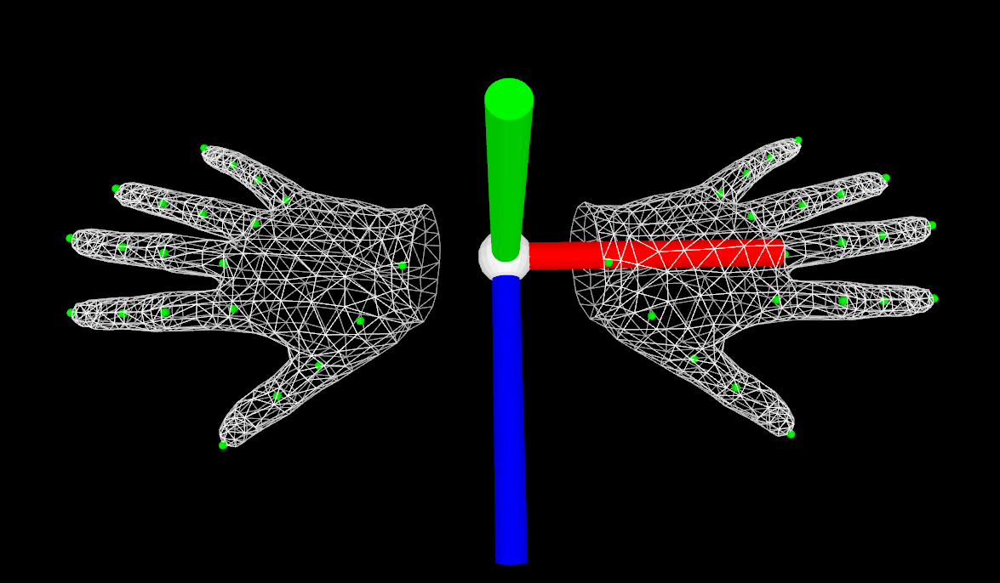
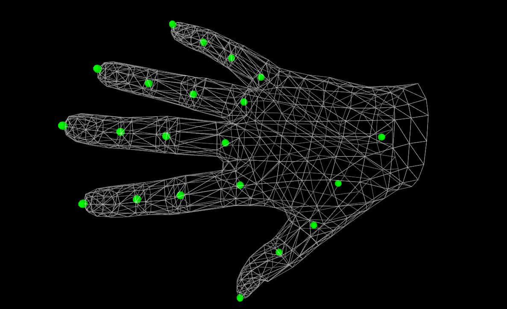

# MANO
A pytorch Implementation of MANO hand model

# Description

This is a pytorch implementation of [MANO](https://mano.is.tue.mpg.de/) hand model loader. The code is based on [smplx](https://github.com/vchoutas/smplx) package by [Vassilis Choutas](https://ps.is.tuebingen.mpg.de/person/vchoutas).

MANO is a differentiable hand model that can map hand pose parameters (joint angles and root location) and shape parameters into a 3D hand mesh. The model is very realistic, has low-dimensions, and can fit any human hand.

This repo was developed to be used in the [GrabNet](https://github.com/otaheri/GrabNet) model to generate realistic hand grasps for unseen 3D objects.



### Requirements
  * [Pytorch>=1.1.0](https://pytorch.org/get-started/locally/) 
  
### Installation
If Pytorch is not installed run the following code for cpu version:
```
pip install torch==1.5.1+cpu torchvision==0.6.1+cpu -f https://download.pytorch.org/whl/torch_stable.html
```
or install the right PyTorch GPU version.

```
pip install git+'https://github.com/otaheri/MANO'

```

### Downloading models

Inorder to download hand models:
* please register at the [MANO](https://mano.is.tue.mpg.de/) website and download the models.
* put the models in a folder with the folowing structure
```bash
models
|
└── mano
    ├── MANO_RIGHT.pkl
    └── MANO_LEFT.pkl

```

### Examples

```python

import torch
import mano
from mano.utils import Mesh

model_path = 'PATH_TO_MANO_MODELS'
n_comps = 45
batch_size = 10

rh_model = mano.load(model_path=rhm_path,
                     is_right= True,
                     num_pca_comps=n_comps,
                     batch_size=batch_size,
                     flat_hand_mean=False)

betas = torch.rand(batch_size, 10)*.1
pose = torch.rand(batch_size, n_comps)*.1
global_orient = torch.rand(batch_size, 3)
transl        = torch.rand(batch_size, 3)

output = rh_model(betas=betas,
                  global_orient=global_orient,
                  hand_pose=pose,
                  transl=transl,
                  return_verts=True,
                  return_tips = True)


h_meshes = rh_model.hand_meshes(output)
j_meshes = rh_model.joint_meshes(output)

#visualize hand mesh only
h_meshes[0].show()

#visualize joints mesh only
j_meshes[0].show()

#visualize hand and joint meshes
hj_meshes = Mesh.concatenate_meshes([h_meshes[0], j_meshes[0]])
hj_meshes.show() 

```

##### Results (Click on the image to open 3D viewer):

[](https://grab.is.tue.mpg.de/uploads/ckeditor/attachments/564/rhand.html)

### Citation

If you use this model for your research, please consider citing:


```
@article{MANO:SIGGRAPHASIA:2017,
  title = {Embodied Hands: Modeling and Capturing Hands and Bodies Together},
  author = {Romero, Javier and Tzionas, Dimitrios and Black, Michael J.},
  journal = {ACM Transactions on Graphics, (Proc. SIGGRAPH Asia)},
  publisher = {ACM},
  month = nov,
  year = {2017},
  url = {http://doi.acm.org/10.1145/3130800.3130883},
  month_numeric = {11}
}
```
and 
```
@inproceedings{GRAB:2020,
  title = {{GRAB}: A Dataset of Whole-Body Human Grasping of Objects},
  author = {Taheri, Omid and Ghorbani, Nima and Black, Michael J. and Tzionas, Dimitrios},
  booktitle = {European Conference on Computer Vision (ECCV)},
  year = {2020},
  url = {https://grab.is.tue.mpg.de}
}
```

### License

Software Copyright License for **non-commercial scientific research purposes**.
Please read carefully the [terms and conditions](https://github.com/otaheri/MANO/blob/master/LICENSE) and any accompanying documentation before you download and/or use the MANO model, data and software, (the "Model & Software"), including 3D meshes, blend weights, blend shapes, software, scripts, and animations. By downloading and/or using the Model & Software (including downloading, cloning, installing, and any other use of this github repository), you acknowledge that you have read these terms and conditions, understand them, and agree to be bound by them. If you do not agree with these terms and conditions, you must not download and/or use the Model & Software. Any infringement of the terms of this agreement will automatically terminate your rights under this [License](./LICENSE).

## Contact
The code of this repository was implemented by [Omid Taheri](https://ps.is.tuebingen.mpg.de/person/otaheri).

For questions, please contact [mano@tue.mpg.de](mano@tue.mpg.de).

For commercial licensing (and all related questions for business applications), please contact [ps-licensing@tue.mpg.de](ps-licensing@tue.mpg.de).
